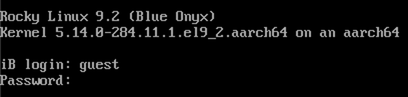

---
# Информационная безопасность

## Лабораторная работа №5

Кузнецов Юрий Владимирович

### Цель работы:

Изучение механизмов изменения идентификаторов, применения SetUID- и Sticky-битов. Получение практических навыков работы в кон- соли с дополнительными атрибутами. Рассмотрение работы механизма смены идентификатора процессов пользователей, а также влияние бита Sticky на запись и удаление файлов.

### Ход работы:

1. Войдите в систему от имени пользователя guest.

2. Создайте программу simpleid.c:

3. Скомплилируйте программу и убедитесь, что файл программы создан:
  gcc simpleid.c -o simpleid

4. Выполните программу simpleid:

5. Выполните системную программу id:
id
и сравните полученный вами результат с данными предыдущего пункта
задания.

6. Усложните программу, добавив вывод действительных идентификато-
ров:

7. Скомпилируйте и запустите simpleid2.c:
  gcc simpleid2.c -o simpleid2
./simpleid2

8. От имени суперпользователя выполните команды:
  chown root:guest /home/guest/simpleid2
   chmod u+s /home/guest/simpleid2

9. Используйте sudo или повысьте временно свои права с помощью su.
Поясните, что делают эти команды.

10. Выполнитепроверкуправильностиустановкиновыхатрибутовисмены
владельца файла simpleid2:
   ls -l simpleid2

11. Запустите simpleid2 и id:
./simpleid2
id

14. Проделайте тоже самое относительно SetGID-бита.

15. Создайте программу readfile.c:

16. Откомпилируйте её.
   gcc readfile.c -o readfile

17. Смените владельца у файла readfile.c (или любого другого текстового файла в системе) и измените права так, чтобы только суперпользователь (root) мог прочитать его, a guest не мог.

18. Проверьте, что пользователь guest не может прочитать файл readfile.c.

19. Смените у программы readfile владельца и установите SetU’D-бит.

20. Проверьте, может ли программа readfile прочитать файл readfile.c?

21. Проверьте, может ли программа readfile прочитать файл /etc/shadow?
Отразите полученный результат и ваши объяснения в отчёте.

22. Выясните, установлен ли атрибут Sticky на директории /tmp, для чего выполните команду
ls -l / | grep tmp

23. Отименипользователяguestсоздайтефайлfile01.txtвдиректории/tmp со словом test:
echo "test" > /tmp/file01.txt

24. Просмотрите атрибуты у только что созданного файла и разрешите чте- ние и запись для категории пользователей «все остальные»:
ls -l /tmp/file01.txt
chmod o+rw /tmp/file01.txt
   ls -l /tmp/file01.txt

25. От пользователя guest2 (не являющегося владельцем) попробуйте про- читать файл /tmp/file01.txt:
cat /tmp/file01.txt

26. От пользователя guest2 попробуйте дозаписать в файл /tmp/file01.txt слово test2 командой
echo "test2" > /tmp/file01.txt
Удалось ли вам выполнить операцию?

27. Проверьте содержимое файла командой
   cat /tmp/file01.txt

28. От пользователя guest2 попробуйте записать в файл /tmp/file01.txt
слово test3, стерев при этом всю имеющуюся в файле информацию ко- мандой
echo "test3" > /tmp/file01.txt
Удалось ли вам выполнить операцию?

29. Проверьте содержимое файла командой
   cat /tmp/file01.txt

30. Отпользователяguest2попробуйтеудалитьфайл/tmp/file01.txtко-
мандой
    rm /tmp/fileOl.txt
Удалось ли вам удалить файл?

31. Повысьте свои права до суперпользователя следующей командой
su -
и выполните после этого команду, снимающую атрибут t (Sticky-бит) с директории /tmp:
chmod -t /tmp

32. Покиньте режим суперпользователя командой
exit

33. От пользователя guest2 проверьте, что атрибута t у директории /tmp
нет:
   ls -l / | grep tmp

34. Повторите предыдущие шаги. Какие наблюдаются изменения?

35. Удалось ли вам удалить файл от имени пользователя, не являющегося
его владельцем? Ваши наблюдения занесите в отчёт.

36. Повысьте свои права до суперпользователя и верните атрибут t на ди- ректорию /tmp:
   su -
   chmod +t /tmp
   exit

### Вывод:
Мы изучили механизмов изменения идентификаторов, применения SetUID- и Sticky-битов. Получение практических навыков работы в консоли с дополнительными атрибутами. Рассмотрение работы механизма смены идентификатора процессов пользователей, а также влияние бита Sticky на запись и удаление файлов.